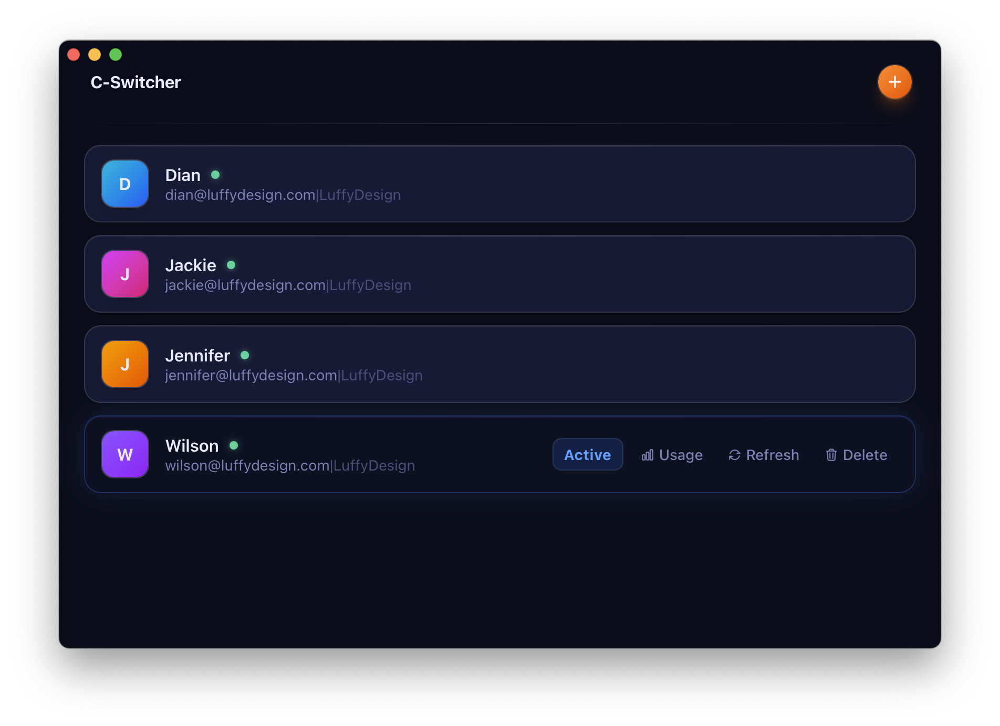
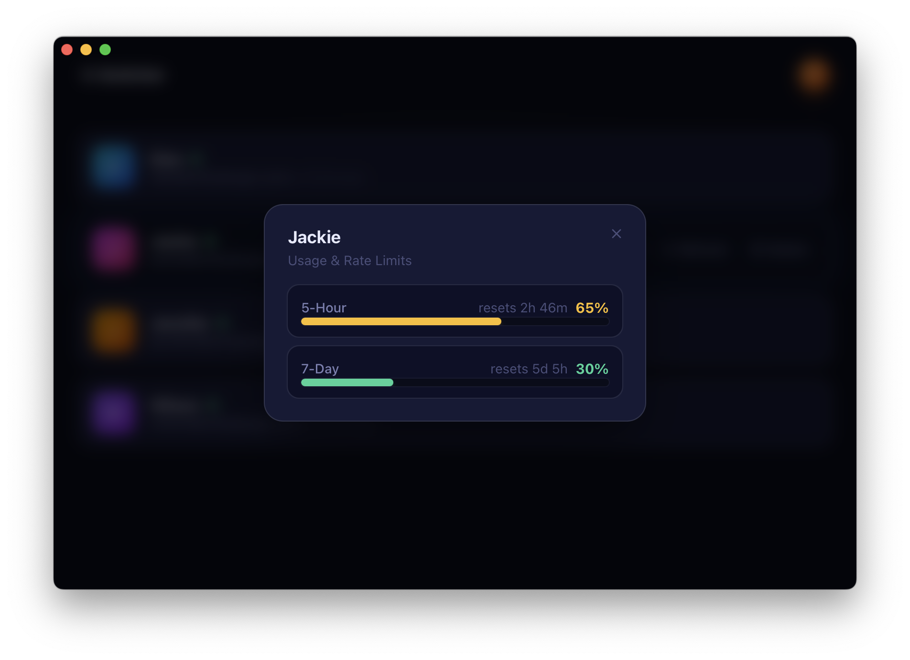
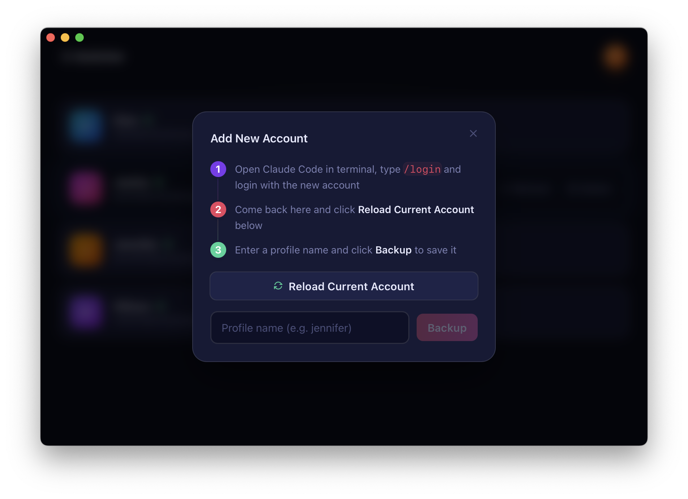

<h1 align="center">C-Switcher</h1>

<p align="center">
  <strong>Multi-account manager for Claude Code</strong><br>
  Switch OAuth profiles, monitor rate limits, and always launch with the least-used account.
</p>

<p align="center">
  
</p>

<p align="center">
  
  
</p>

---

## Desktop App

A native macOS app (built with Tauri) for managing Claude Code OAuth profiles.

- **Profile list** — see all saved accounts with login status at a glance
- **One-click switch** — swap the active account instantly
- **Usage monitor** — view real-time 5-hour & 7-day rate limit utilization
- **Token refresh** — renew expired OAuth tokens without re-login
- **Guided setup** — add new accounts with a step-by-step flow

---

## `csw` CLI

A single command that queries all profiles in parallel, picks the account with the lowest rate limit, switches to it, and `exec`s `claude`.

### Install

```bash
cargo install --path src-tauri --bin csw
```

### Quick Start

```bash
csw                           # auto-select lowest 5h usage → switch → launch claude
csw -l                        # print usage table and exit
csw -i                        # interactive: choose from table → switch → launch claude
csw -- --resume               # auto-select + pass flags to claude
```

### Options

| Flag | Description |
|---|---|
| `-l` `--list` | Print usage table and exit |
| `-i` `--interactive` | Interactive profile selection |
| `-h` `--help` | Show help |
| `--` | Pass remaining args to `claude` |

### How It Works

```
~/.claude_profiles/*.json
        │
        ▼
   fetch usage ──── Anthropic API (parallel requests)
        │
        ▼
   sort by 5h% ──── tiebreak by 7d%
        │
        ▼
   switch keychain + ~/.claude.json
        │
        ▼
   exec claude
```

> Table output goes to **stderr**. Colors: 🟢 < 50% · 🟡 50–80% · 🔴 > 80%

---

## Prerequisites

| Requirement | Why |
|---|---|
| **macOS** | Tokens stored in Keychain |
| [Rust](https://rustup.rs/) | Build the CLI and Tauri app |
| Node.js + npm | Build the frontend |
| Profiles via Desktop App | `csw` reads `~/.claude_profiles/` |

## Development

```bash
npm run tauri dev
```

## Build

```bash
npm install && npm run tauri build
```

The built `.dmg` will be in `src-tauri/target/release/bundle/dmg/`.

Alternatively, push a version tag to trigger CI/CD and get all platform artifacts automatically:

```bash
git tag v0.1.0
git push origin v0.1.0
```

GitHub Actions will build and publish to [Releases](../../releases):
- `C-Switcher-macos-universal.dmg`
- `C-Switcher-windows-x64.msi`
- `C-Switcher-windows-x64-setup.exe`
- `csw-macos-arm64`
- `csw-macos-x86_64`

## License

MIT
